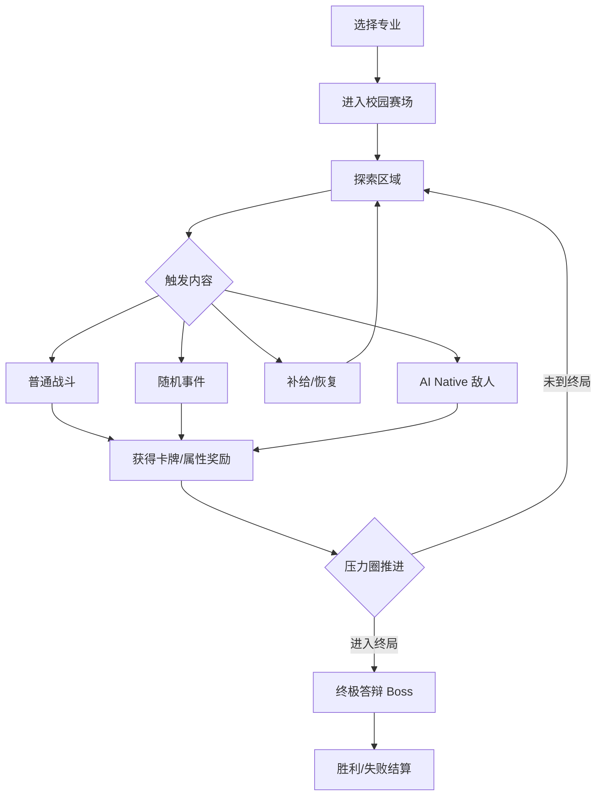

# 《专业大逃杀》MVP 开发计划书

> 文件名：20260706-major-royale-mvp.md  
> 推荐仓库名：`major-royale`  
> 仓库简介：一款像素 2.5D 半开放世界肉鸽卡牌游戏。玩家选择大学专业作为战斗流派，在校园异化赛场中探索、构筑卡组、遭遇 AI Native 敌人，并在终极答辩中争夺“唯一上岸者”。

## 1. 项目定位

《专业大逃杀》第一版不做纯动作大逃杀，而是做：

> **2.5D 半开放世界探索 + 肉鸽卡牌战斗 + 专业流派构筑 + 少量 AI Native 特殊敌人。**

玩家开局选择一个专业，每个专业拥有不同八维属性、初始卡组、主动技能和被动机制。玩家在像素校园赛场中自由探索若干区域，触发事件、战斗、补给和精英遭遇。战斗进入卡牌肉鸽模式，通过抽牌、出牌、资源管理和专业技能击败敌人。

MVP 的核心目标不是做一个“大而全”的开放世界，而是验证四件事：

1. 专业是否能形成有趣、可传播的战斗流派。
2. 2.5D 地图探索是否能承载校园大逃杀氛围。
3. 卡牌战斗是否能体现肉鸽构筑乐趣。
4. AI Native 敌人是否能带来区别于普通小兵的行为变化和结局分支。

## 2. MVP 版本边界

### 2.1 本版本必须做

1. 单人离线主流程。
2. 2.5D 像素校园地图，支持玩家移动、区域切换、交互点触发。
3. 3 个可选专业：计算机、法学、医学。
4. 每个专业包含八维属性、初始卡组、1 个主动技能、1 个被动技能。
5. 卡牌战斗系统：抽牌、能量、出牌、弃牌、回合推进、敌人行动。
6. 肉鸽奖励：战斗胜利后选择 1 张新卡、属性提升或临时 Buff。
7. 5 类地图区域：宿舍、教学楼、图书馆、食堂、操场。
8. 普通敌人、精英敌人、最终 Boss。
9. 至少 2 个 AI Native 敌人，用结构化 AI 决策影响战斗行为。
10. 一局完整流程：选择专业 -> 探索 -> 战斗/事件 -> 强化 -> 终极答辩 -> 胜利/失败。
11. 中文 UI、基础音效占位、像素角色占位图。
12. 每完成一个开发阶段进行一次中文 commit。

### 2.2 本版本明确不做

1. 不做多人联网大逃杀。
2. 不做大型无缝开放世界。
3. 不做复杂动作战斗、闪避、连招、命中盒手感。
4. 不做完整剧情长线和大量 NPC 对话。
5. 不做精致角色立绘和复杂动画。
6. 不做装备词条大系统。
7. 不做关卡编辑器。
8. 不做手游适配和商业化支付。
9. 不做所有敌人的 AI 接入。
10. 不让 AI 直接自由控制游戏对象，只允许 AI 在预设动作集合中做选择。

## 3. 推荐技术方向

建议使用 `Godot 4.x` 开发 MVP。

原因：

1. 适合 2D / 2.5D 像素游戏。
2. 场景、节点、动画、UI 和输入系统上手快。
3. 导出桌面端方便，MVP 验证成本低。
4. 卡牌、地图、敌人、事件都可以用资源文件或 JSON 数据驱动。

### 3.1 目标平台

MVP 第一版只做：

1. Windows 桌面端。
2. macOS 桌面端。
3. 开发调试端。

暂不做 WebGL、Android、iOS。

## 4. 核心玩法循环



## 5. 世界设定

某天，所有大学专业被卷入一个名为“终极就业筛选系统”的异常赛场。校园、考场、图书馆、实习公司和招聘会被融合成半开放空间。每个学生都必须以自己的专业作为战斗身份，在不断增加的压力、考试、实习、答辩和资源竞争中生存。

最终存活并通过终极答辩的人，将获得称号：

> **唯一上岸者**

## 6. 2.5D 半开放世界设计

### 6.1 地图形态

MVP 不做真正开放世界，而做“可探索区域 + 节点事件”的半开放结构。

地图由 5 个区域组成：

| 区域 | 功能定位 | 典型事件 |
|---|---|---|
| 宿舍 | 恢复、随机负面、熬夜收益 | 睡觉恢复、熬夜刷题、室友噪音 |
| 教学楼 | 普通战斗、考试事件 | 随堂测验、课堂点名、专业对抗 |
| 图书馆 | 卡牌强化、专注提升 | 查资料、抢座、沉浸学习 |
| 食堂 | 补给、随机 Buff | 抢饭、黑暗料理、回血 |
| 操场 | 体能事件、遭遇敌人 | 跑圈、体育生挑战、压力圈缩小 |

### 6.2 地图交互

玩家可以在地图中移动并与交互点互动。交互点包括：

1. 战斗点。
2. 事件点。
3. 补给点。
4. 卡牌奖励点。
5. 精英敌人点。
6. 终局入口。

### 6.3 像素小人要求

MVP 阶段角色美术只要求“可读、可区分、可替换”。

最低要求：

1. 玩家角色 1 套基础行走动画，4 方向或 8 方向均可。
2. 敌人可以先用不同颜色、帽子、道具轮廓区分。
3. 专业差异先通过 UI、技能名、卡牌、Buff 图标体现。
4. 暂不追求精致像素动画。

## 7. 专业系统

### 7.1 八维属性

| 属性 | 作用 |
|---|---|
| 学识 | 技能强度、科技/知识类卡牌效果 |
| 体能 | 最大生命、部分防御收益 |
| 专注 | 抽牌、命中、持续效果稳定性 |
| 表达 | 控制、辩论、打断类效果 |
| 创造 | 随机牌、特殊构筑、异常效果 |
| 社交 | 交易、召唤、事件成功率 |
| 抗压 | 精神值、负面状态抵抗 |
| 资源 | 初始金币、补给、奖励质量 |

### 7.2 MVP 专业

#### 计算机专业

定位：远程控制、异常状态、技术爆发。

初始特点：

1. 学识高。
2. 专注高。
3. 体能偏低。
4. 容易打出连锁效果。

主动技能：`代码注入`  
效果：使敌人下一回合行动有概率失效，并附加 `Bug` 状态。

被动技能：`熬夜 Debug`  
效果：生命低于 40% 时，每回合额外抽 1 张牌，但精神值下降。

初始卡牌示例：

| 卡牌 | 类型 | 效果 |
|---|---|---|
| Bug 生成 | 技能 | 造成少量伤害，附加 Bug |
| 快速脚本 | 技能 | 抽 1 张牌 |
| 重构 | 防御 | 获得护盾，移除 1 个负面状态 |
| 代码审查 | 控制 | 查看敌人下回合意图 |
| 蓝屏警告 | 终结 | 若敌人有 3 层 Bug，造成高额伤害 |

#### 法学专业

定位：反制、控场、规则利用。

主动技能：`异议！`  
效果：打断敌人一次强行动，并使其进入 `举证失败`。

被动技能：`条文护体`  
效果：每场战斗首次受到致命伤时保留 1 点生命，并获得护盾。

初始卡牌示例：

| 卡牌 | 类型 | 效果 |
|---|---|---|
| 举证责任 | 控制 | 降低敌人伤害 |
| 无罪辩护 | 防御 | 获得护盾，清除 1 个负面 |
| 法条检索 | 技能 | 抽牌并获得临时能量 |
| 庭审拖延 | 控制 | 延后敌人行动 |
| 判决书 | 终结 | 根据敌人负面状态数量造成伤害 |

#### 医学专业

定位：续航、弱点打击、负面清除。

主动技能：`紧急缝合`  
效果：恢复生命并移除流血、中毒等身体负面状态。

被动技能：`人体结构熟悉`  
效果：攻击有概率命中弱点，造成额外伤害。

初始卡牌示例：

| 卡牌 | 类型 | 效果 |
|---|---|---|
| 急救包扎 | 治疗 | 恢复少量生命 |
| 解剖弱点 | 攻击 | 造成伤害并附加易伤 |
| 病历分析 | 技能 | 查看敌人意图，抽 1 张牌 |
| 肾上腺素 | 强化 | 本回合攻击牌伤害提升 |
| 夜班坚守 | 防御 | 获得护盾和抗压 |

## 8. 战斗系统

### 8.1 战斗形式

战斗采用回合制卡牌肉鸽。

基础规则：

1. 玩家每回合抽 5 张牌。
2. 玩家每回合有 3 点能量。
3. 卡牌消耗能量。
4. 回合结束后弃掉未使用手牌。
5. 敌人每回合显示一个意图。
6. 玩家根据敌人意图决定攻击、防御、控制或治疗。

### 8.2 卡牌类型

| 类型 | 作用 |
|---|---|
| 攻击牌 | 造成伤害 |
| 防御牌 | 获得护盾、减伤 |
| 技能牌 | 抽牌、回能、附加状态 |
| 控制牌 | 打断、沉默、延迟敌人行动 |
| 治疗牌 | 回复生命、清除负面 |
| 终结牌 | 满足条件时造成高额收益 |

### 8.3 状态效果

MVP 只做少量状态，避免数值系统失控。

| 状态 | 效果 |
|---|---|
| Bug | 叠层后触发额外伤害或行动失败 |
| 举证失败 | 下一次攻击降低或被反制 |
| 易伤 | 受到伤害增加 |
| 流血 | 每回合损失生命 |
| 护盾 | 抵消伤害 |
| 压力 | 精神下降，影响抽牌或事件判定 |

## 9. 敌人设计

### 9.1 敌人分层

MVP 中敌人分为 4 类：

| 类型 | 说明 | 是否接 AI |
|---|---|---|
| 普通小兵 | 校园赛场中的基础敌人 | 否 |
| 事件敌人 | 由考试、点名、抢座等事件触发 | 否 |
| 精英敌人 | 每局中期出现，机制更复杂 | 部分是 |
| 最终 Boss | 终极答辩阶段出现 | 可选接 AI |

### 9.2 普通敌人

普通敌人用于提供稳定战斗节奏，不接 AI。

示例：

| 敌人 | 定位 | 行为 |
|---|---|---|
| 绩点焦虑者 | 压力型敌人 | 施加压力、低伤害攻击 |
| 抢座学霸 | 防御型敌人 | 护盾、反击 |
| 熬夜卷王 | 持续伤害敌人 | 每回合叠压力 |
| 体育特长生 | 高攻击敌人 | 蓄力重击 |
| 甲方幻影 | 干扰型敌人 | 修改玩家手牌费用 |

### 9.3 AI Native 敌人是什么

AI Native 敌人不是“数值更高的小兵”，而是拥有一个轻量思考层的特殊敌人。

它们的特点：

1. 会读取当前战斗状态。
2. 会根据玩家专业、血量、手牌倾向、已叠状态做决策。
3. 会在预设动作集合中选择行动。
4. 会给出一句短的中文意图描述。
5. 会触发不同结局分支或战斗后事件。

关键限制：

1. AI 不能直接改游戏数值。
2. AI 不能生成任意行动。
3. AI 只能从开发者提供的 `allowed_actions` 中选择。
4. AI 输出必须是 JSON。
5. AI 超时或失败时，使用规则 AI 兜底。

### 9.4 AI Native 敌人 MVP 示例

#### 敌人 1：AI 面试官

出现区域：教学楼 / 终极答辩前。

定位：根据玩家专业和战斗表现动态施压。

可选行动：

| 行动 ID | 行动名 | 效果 |
|---|---|---|
| ask_algorithm | 算法追问 | 对计算机专业施加额外压力 |
| ask_ethics | 职业伦理 | 降低玩家下一张攻击牌效果 |
| resume_challenge | 简历质疑 | 造成精神伤害 |
| praise_then_pressure | 先夸后压 | 玩家抽牌 +1，但获得压力 |
| silent_observe | 沉默观察 | 本回合防御，下回合强化 |

AI 输入：

```json
{
  "enemy": "AI面试官",
  "player_major": "计算机",
  "player_hp": 32,
  "player_spirit": 45,
  "visible_player_status": ["Bug构筑", "低生命"],
  "last_player_actions": ["快速脚本", "Bug生成"],
  "allowed_actions": ["ask_algorithm", "ask_ethics", "resume_challenge", "praise_then_pressure", "silent_observe"]
}
```

AI 输出：

```json
{
  "action_id": "ask_algorithm",
  "intent_text": "面试官察觉你依赖 Bug 连锁，决定追问算法复杂度。",
  "ending_flag": "tech_pressure"
}
```

#### 敌人 2：论文审稿人

出现区域：图书馆 / 精英事件。

定位：会针对玩家反复使用的卡牌提出“拒稿理由”。

可选行动：

| 行动 ID | 行动名 | 效果 |
|---|---|---|
| reject_core_card | 拒绝核心卡 | 玩家下回合某类卡费用 +1 |
| demand_revision | 要求大修 | 玩家弃 1 张牌，抽 2 张牌 |
| question_method | 质疑方法 | 附加压力 |
| accept_minor | 小修接收 | 敌人获得护盾，但玩家获得奖励标记 |
| desk_reject | 直接拒稿 | 造成伤害，但敌人下回合虚弱 |

不同结局：

1. 如果玩家击败它：获得稀有卡 `接收通知`。
2. 如果玩家用控制牌击败它：获得事件称号 `优雅 rebuttal`。
3. 如果玩家精神值过低失败：进入 `延毕阴影` 结局分支。

### 9.5 最终 Boss

最终 Boss：`就业压力`

不一定第一版接 AI。建议先用规则行为实现，第二版再升级为 AI Native Boss。

阶段设计：

| 阶段 | 名称 | 行为 |
|---|---|---|
| 阶段 1 | 简历筛选 | 普通攻击、压力叠加 |
| 阶段 2 | 群面混战 | 召唤小兵、限制手牌 |
| 阶段 3 | 终极答辩 | 高压提问、随机专业克制 |

## 10. AI Native 设计边界

AI Native 是 MVP 的亮点，但不能成为 MVP 的最大风险。

### 10.1 本版本 AI 只做决策，不做生成式内容大系统

AI 只负责：

1. 选择敌人下一步行动。
2. 生成一句短意图文本。
3. 返回一个结局标记。

AI 不负责：

1. 即时生成新卡牌。
2. 即时生成新敌人。
3. 即时改数值。
4. 控制地图。
5. 编写剧情长文本。

### 10.2 兜底策略

如果 AI 调用失败：

1. 使用规则表选择行动。
2. UI 显示普通敌人意图。
3. 不中断战斗。
4. 记录日志，方便后续调试。

## 11. 数据结构建议

MVP 建议优先数据驱动，方便后续扩展。

推荐配置：

```text
data/
  majors/
    computer.json
    law.json
    medicine.json
  cards/
    common_cards.json
    computer_cards.json
    law_cards.json
    medicine_cards.json
  enemies/
    normal_enemies.json
    elite_enemies.json
    ai_native_enemies.json
  events/
    dorm_events.json
    classroom_events.json
    library_events.json
```

## 12. UI 与美术风格

### 12.1 视觉风格

1. 像素风。
2. 斜 45 度 2.5D 视角。
3. 校园 + 异化赛场 + 轻微荒诞感。
4. 色彩不宜过暗，保证卡牌和角色可读性。
5. UI 使用中文，按钮和卡牌信息清晰优先。

### 12.2 第一版界面

必须包含：

1. 主菜单。
2. 专业选择界面。
3. 地图探索界面。
4. 战斗界面。
5. 奖励选择界面。
6. 结算界面。
7. 设置界面。

### 12.3 战斗界面布局

建议：

1. 上方显示敌人、血量、意图。
2. 中间显示战斗区域和状态。
3. 下方显示手牌。
4. 左侧显示玩家生命、精神、能量。
5. 右侧显示弃牌堆、抽牌堆、专业技能。

## 13. 开发阶段计划

每完成一个阶段，必须进行一次中文 commit。commit 信息使用中文，清楚描述本阶段完成内容。

### 阶段 0：仓库初始化

目标：

1. 创建 Godot 项目。
2. 建立基础目录结构。
3. 添加 README。
4. 添加基础配置文件。

完成标准：

1. 项目可以打开。
2. 主场景可以运行。
3. README 说明项目定位和启动方式。

建议 commit：

```bash
git add .
git commit -m "初始化专业大逃杀 MVP 项目结构"
```

### 阶段 1：基础地图探索

目标：

1. 实现玩家在 2.5D 地图中移动。
2. 实现 5 个区域的基础地图或占位地图。
3. 实现交互点触发。
4. 实现从地图进入事件/战斗的入口。

完成标准：

1. 玩家可以在校园地图中移动。
2. 至少能进入宿舍、教学楼、图书馆 3 个区域。
3. 点击/靠近交互点可以触发 UI。

建议 commit：

```bash
git add .
git commit -m "完成校园地图探索与交互点触发"
```

### 阶段 2：专业选择与属性系统

目标：

1. 实现专业选择界面。
2. 实现八维属性展示。
3. 接入计算机、法学、医学 3 个专业。
4. 专业数据从配置读取。

完成标准：

1. 可以选择专业开始游戏。
2. 不同专业有不同属性。
3. 进入游戏后能读取玩家专业信息。

建议 commit：

```bash
git add .
git commit -m "完成专业选择与八维属性系统"
```

### 阶段 3：卡牌战斗核心

目标：

1. 实现回合制战斗。
2. 实现抽牌、出牌、弃牌、能量。
3. 实现攻击、防御、技能牌。
4. 实现敌人普通行动。

完成标准：

1. 玩家可以进入一场完整战斗。
2. 玩家能使用卡牌击败敌人。
3. 敌人能按规则攻击或防御。
4. 胜负能正常结算。

建议 commit：

```bash
git add .
git commit -m "完成卡牌战斗核心循环"
```

### 阶段 4：专业卡组与技能

目标：

1. 为 3 个专业接入初始卡组。
2. 实现每个专业 1 个主动技能。
3. 实现每个专业 1 个被动技能。
4. 实现基础状态效果。

完成标准：

1. 计算机能打出 Bug 流。
2. 法学能打出反制控制。
3. 医学能打出续航弱点。
4. 三个专业战斗体验有明显差异。

建议 commit：

```bash
git add .
git commit -m "完成三大专业卡组与专属技能"
```

### 阶段 5：肉鸽奖励与事件

目标：

1. 战斗胜利后出现奖励选择。
2. 实现卡牌奖励、属性奖励、临时 Buff。
3. 实现宿舍、图书馆、食堂等随机事件。
4. 加入压力圈推进机制。

完成标准：

1. 玩家每场战斗后能变强。
2. 探索时能遇到非战斗事件。
3. 一局游戏有越来越强的压力。

建议 commit：

```bash
git add .
git commit -m "完成肉鸽奖励、随机事件与压力推进"
```

### 阶段 6：敌人系统

目标：

1. 接入普通敌人。
2. 接入事件敌人。
3. 接入精英敌人。
4. 实现最终 Boss `就业压力`。

完成标准：

1. 至少 5 个普通敌人。
2. 至少 2 个精英敌人。
3. 最终 Boss 有 3 个阶段。
4. 玩家可以完成一局从开局到终局的流程。

建议 commit：

```bash
git add .
git commit -m "完成普通敌人、精英敌人与最终 Boss"
```

### 阶段 7：AI Native 敌人

目标：

1. 接入 AI Native 敌人配置。
2. 实现 `allowed_actions` 结构化决策。
3. 实现 AI 调用失败兜底。
4. 完成 `AI 面试官` 和 `论文审稿人` 两个敌人。

完成标准：

1. AI Native 敌人能根据战斗状态选择行动。
2. 输出 JSON 可被游戏解析。
3. 失败时规则 AI 能接管。
4. 不出现 AI 卡死战斗的情况。

建议 commit：

```bash
git add .
git commit -m "完成 AI Native 敌人决策与兜底机制"
```

### 阶段 8：UI、音效与完整体验打磨

目标：

1. 补齐主菜单、设置、结算界面。
2. 增加基础音效和反馈。
3. 优化卡牌说明、状态图标、敌人意图显示。
4. 修复主流程 Bug。

完成标准：

1. 新玩家能无说明完成一局。
2. 胜利、失败、奖励、战斗反馈清晰。
3. 卡牌文字不溢出。
4. 游戏能连续运行多局。

建议 commit：

```bash
git add .
git commit -m "完成 MVP 界面音效与主流程打磨"
```

### 阶段 9：打包与验收

目标：

1. 打包 Windows 和 macOS 测试版本。
2. 编写 README、操作说明、MVP 边界说明。
3. 整理已知问题。
4. 录制一段 1 分钟演示视频。

完成标准：

1. 可下载运行。
2. 无阻塞级崩溃。
3. README 能说明玩法和启动方式。
4. 交付包中包含版本号和更新记录。

建议 commit：

```bash
git add .
git commit -m "完成 MVP 打包交付与说明文档"
```

## 14. MVP 验收标准

### 14.1 功能验收

1. 可以从主菜单开始游戏。
2. 可以选择 3 个专业之一。
3. 可以在地图中移动并触发交互点。
4. 可以进入卡牌战斗。
5. 可以使用卡牌击败普通敌人。
6. 可以获得肉鸽奖励。
7. 可以遭遇 AI Native 敌人。
8. 可以进入终极答辩并挑战 Boss。
9. 可以胜利或失败结算。
10. 可以重新开始一局。

### 14.2 体验验收

1. 三个专业的玩法差异明显。
2. 玩家能理解敌人下一步要做什么。
3. AI Native 敌人的行为与普通敌人有明显区别。
4. 一局游戏时长控制在 15 到 25 分钟。
5. 前 5 分钟能体验到探索、战斗、奖励三件事。

### 14.3 技术验收

1. 没有主流程阻塞 Bug。
2. AI 调用失败不影响战斗继续。
3. 数据配置和逻辑代码分离。
4. 每个开发阶段都有中文 commit。
5. 代码目录清晰，便于后续扩展专业、卡牌、敌人。

## 15. 版本里程碑

| 版本 | 内容 | 目标 |
|---|---|---|
| v0.1 | 地图移动 + 专业选择 | 验证探索框架 |
| v0.2 | 卡牌战斗核心 | 验证战斗可玩 |
| v0.3 | 三专业卡组 | 验证专业差异 |
| v0.4 | 肉鸽奖励 + 事件 | 验证循环完整 |
| v0.5 | 敌人和 Boss | 打通完整局 |
| v0.6 | AI Native 敌人 | 做出核心亮点 |
| v1.0-mvp | 打磨和打包 | 可演示交付 |

## 16. 后续可扩展方向

MVP 成功后再考虑：

1. 增加专业：土木、金融、艺术、新闻、师范、心理学。
2. 增加转专业 / 辅修系统。
3. 增加更多 AI Native 敌人。
4. 增加 AI 事件叙事。
5. 增加地图区域：招聘会、实验楼、答辩厅、实习公司。
6. 增加职业结局和多结局分支。
7. 增加遗产成长：履历点、证书、称号。
8. 增加移动端适配。

## 17. 第一版最小内容清单

如果开发时间很紧，必须优先保留以下内容：

1. 计算机、法学、医学 3 个专业。
2. 卡牌战斗核心。
3. 2.5D 地图探索。
4. 肉鸽奖励。
5. AI 面试官。
6. 最终 Boss 就业压力。

可以暂时砍掉：

1. 精致像素动画。
2. 复杂音效。
3. 大量随机事件。
4. 第二个 AI Native 敌人。
5. 多区域细节地图。
6. 多结局文本。

## 18. 给开发 Agent 的执行原则

1. 先打通一局完整流程，再补内容。
2. 所有新增内容优先配置化。
3. 不要为了 AI Native 敌人牺牲主流程稳定性。
4. 卡牌文字要短，效果要清楚。
5. 像素美术先用占位资源，后续可替换。
6. 每个阶段完成后必须运行项目验证。
7. 每个阶段完成后必须进行一次中文 commit。
8. 不要超出 MVP 边界私自增加大系统。

